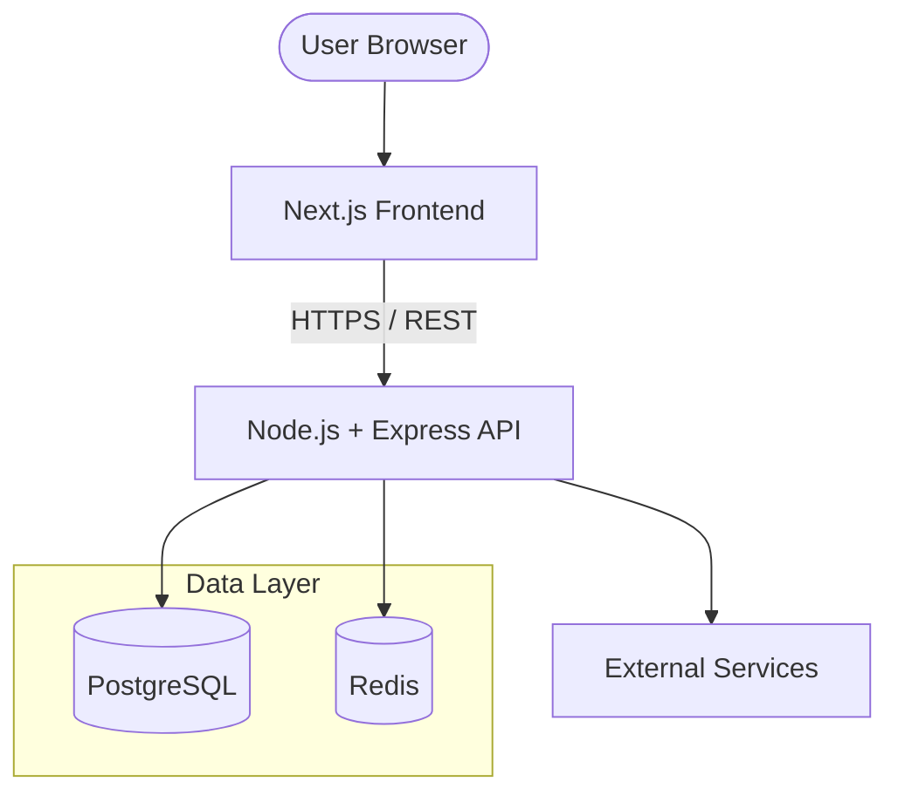

# 🛒 E-commerce Application – Tech Stack Document

---

## 1. Overview
This document describes the technology stack used to build a scalable, secure, and production-ready e-commerce application. The stack emphasizes type safety, performance, developer experience, and modern best practices, using TypeScript end-to-end.

---

## 2. High-Level Architecture

---

## 3. Backend Stack

### 3.1 Runtime & Language

| Technology | Purpose |
| :--- | :--- |
| **Node.js** | JavaScript runtime for backend services |
| **TypeScript** | Static typing, better maintainability, fewer runtime errors |

**Why TypeScript (Mandatory):**
- Compile-time safety for APIs and database models.
- Strong IDE support.
- Safer refactoring at scale.

### 3.2 Web Framework

| Technology | Purpose |
| :--- | :--- |
| **Express.js** | Lightweight HTTP server & routing |

**Rationale:**
- Minimal and unopinionated.
- Easy integration with middleware (auth, validation, logging).
- Mature ecosystem.

### 3.3 Database Layer

| Technology | Purpose |
| :--- | :--- |
| **PostgreSQL** | Primary relational database |
| **Prisma ORM** | Type-safe database access & migrations |

**Why PostgreSQL:**
- ACID-compliant.
- Strong relational integrity.
- Ideal for orders, payments, and inventory.

**Why Prisma:**
- Auto-generated TypeScript types.
- Schema-driven development.
- Safe migrations.
- Excellent DX with Postgres.

### 3.4 Authentication & Authorization

| Technology | Purpose |
| :--- | :--- |
| **jsonwebtoken (JWT)** | Access & refresh token generation |
| **HTTP-only Cookies** | Secure token storage |

**Auth Strategy:**
- Short-lived Access Tokens.
- Long-lived Refresh Tokens.
- Token rotation supported.
- Stateless access with Redis-backed sessions.

### 3.5 Caching & Session Management

| Technology | Purpose |
| :--- | :--- |
| **Redis** | In-memory data store |

**Use Cases:**
- Refresh token sessions.
- Rate limiting.
- Caching product listings.
- Distributed locks (inventory).
- Background job coordination.

### 3.6 API Design
- RESTful endpoints.
- JSON payloads.
- Versioned APIs (`/api/v1`).
- Centralized error handling.
- Request validation (e.g., Zod).

---

## 4. Frontend Stack

### 4.1 Framework & Language

| Technology | Purpose |
| :--- | :--- |
| **Next.js (App Router)** | React framework for SSR & SSG |
| **TypeScript** | Type safety across UI & API |

**Why Next.js:**
- Server-side rendering (SEO-friendly).
- Built-in routing.
- API route support (optional BFF).
- Image and font optimization.

### 4.2 Styling & UI

| Technology | Purpose |
| :--- | :--- |
| **Tailwind CSS** | Utility-first styling |
| **shadcn/ui** | Accessible, composable UI components |
| **Lucide Icons** | Consistent icon system |

**Benefits:**
- Rapid UI development.
- Design consistency.
- No runtime CSS overhead.
- Accessible by default.

### 4.3 State Management

| Technology | Purpose |
| :--- | :--- |
| **Redux Toolkit** | Global state management |
| **RTK Query** | Server data fetching & caching |

**Usage:**
- Auth state.
- Cart state.
- User preferences.
- API data fetching with automatic cache invalidation.

### 4.4 Data Fetching
- **RTK Query** for client-side API calls with caching & auto-refresh.
- Native `fetch` (Next.js enhanced) for server components.
- Server Components for initial data.
- Client Components for interactions.
- Optional caching via Next.js revalidation.

---

## 5. Security Considerations
- HTTPS enforced.
- HTTP-only, Secure cookies.
- CSRF protection (Same-site cookies).
- Input validation on all endpoints.
- Rate limiting via Redis.
- Environment variables for secrets.

---

## 6. DevOps & Environment

### 6.1 Containerization

| Technology | Purpose |
| :--- | :--- |
| **Docker** | Consistent dev & prod environments |
| **Docker Compose** | Multi-service orchestration |

**Services:**
- Backend (Express API)
- Frontend (Next.js)
- PostgreSQL
- Redis

### 6.2 Environment Configuration
- `.env` files.
- Separate configs for dev / staging / prod.
- No secrets committed to source control.

---

## 7. Testing Strategy (Recommended)

| Type | Tools |
| :--- | :--- |
| **Unit Tests** | Jest / Vitest |
| **Integration Tests** | Supertest |
| **E2E (Optional)** | Playwright |

---

## 8. Scalability & Future Enhancements
- Horizontal API scaling (stateless auth).
- Redis-backed sessions.
- CDN for assets.
- Background jobs (emails, order processing).
- Payment gateway integration.
- Webhooks for order lifecycle.

---

## 9. Summary
This tech stack provides:
- ✅ **End-to-end TypeScript**
- ✅ **Production-grade authentication**
- ✅ **Scalable data layer**
- ✅ **Modern frontend with excellent UX**
- ✅ **Strong developer experience**

It is well-suited for real-world e-commerce workloads, from MVP to large-scale deployment.

